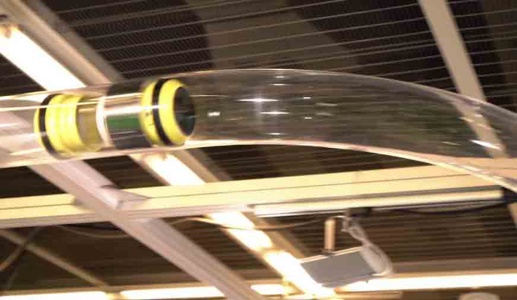

# tube

A websocket client and server library.

Features:
  - Client libraries for Clojure, ClojureScript, and C++
  - Server library for Clojure

## Installation via Leiningen / Clojars:

## License

Original work Copyright (c) 2016 FarBetter, Inc.
Modified work Copyright (c) 2017 Deer Creek Labs, LLC

Distributed under the Apache Software License, Version 2.0
http://www.apache.org/licenses/LICENSE-2.0.txt
